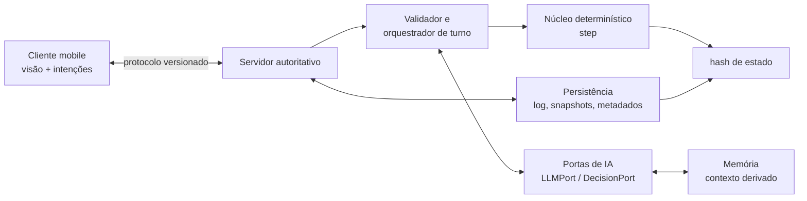

# SDD 00 — Visão geral da arquitetura

- **Status:** Proposta para revisão do SDD; GDD aprovado em 2026-10-01 e ADR-0007 aceito.
- **Escopo:** topologia, fronteiras e fluxo de turno. Os detalhes pertencem aos SDDs 01–14.
- **ADRs relacionados:** ADR-0001, ADR-0002, ADR-0003, ADR-0006, ADR-0007 (aceito) e ADR-0008.

## Objetivo

Definir os contratos estáveis entre cliente, servidor, núcleo de simulação, IA e armazenamento.
O desenho prioriza estado, comandos, versões e invariantes; por isso pode sobreviver à substituição
de linguagens, banco ou engine de cliente. A implementação segue a stack aceita no ADR-0007:
Rust, Godot 4 e PostgreSQL; Markdown e SQLite FTS5 atendem à memória, com Docker Compose e
GitHub Actions na infraestrutura.

## Responsabilidades e fronteiras

O subsistema organiza uma partida persistente de 4–8 civilizações no MVP e, no máximo, oito na 1.0.
Há uma civilização por jogador em cada mundo. O servidor é autoritativo: recebe intenções externas,
decide sua ordem de aceitação, persiste os fatos e publica uma visão do estado; o cliente apenas
apresenta essa visão e solicita ações.

O núcleo é a fonte de verdade das regras. Ele transforma um estado e comandos validados em um novo
estado, resolve combate na fase própria e calcula o fim do turno. Ele não conhece sockets, contas,
chaves, banco, relógio, UI, LLMs ou busca de memória.

As portas de IA convertem contexto derivado em intenções tipadas. A validação e a conversão de
intenção para comando continuam no lado autoritativo, antes do núcleo. A memória preserva e recupera
contexto auxiliar; jamais é fonte de verdade do mundo.

Este SDD não define: fórmulas de cidades e rendimentos, mapa hexagonal, regras de combate, schema
completo do Mandato, catálogo de eventos, regras diplomáticas, formato final de API, criptografia
ou UI mobile. Esses assuntos serão detalhados nos SDDs específicos, sem contrariar estes contratos.

## Topologia proposta



`N` será biblioteca Rust pura; `S` será servidor Rust; `C` será Godot 4; `P` usará PostgreSQL
para fatos da partida; e `M` manterá Markdown canônico e índice SQLite FTS5. Essas são as
implementações decididas no ADR-0007.

## Conceitos e versões

Todo identificador de domínio é opaco e estável dentro de um mundo: `WorldId`, `TurnNumber`,
`CivilizationId`, `EntityId`, `CommandId`, `CatalogVersion` e `RulesVersion`. Todo payload que cruza
uma fronteira declara `protocol_version`; todo comando persistido declara `rules_version`,
`catalog_version` e `rng_version`. Um replay é interpretado pelas versões gravadas, nunca pelas
definições atuais por acidente.

O servidor mantém duas visões separadas:

- `AuthoritativeState`: estado integral usado pelo núcleo e nunca enviado integralmente ao cliente.
- `ClientView`: projeção autorizada para uma civilização ou espectador; informação oculta permanece
  ausente, e não apenas marcada como escondida.

## Contratos principais

Os esquemas abaixo são pseudocódigo independente de stack. A serialização concreta é decisão futura.

```text
type StepInput = {
  state: AuthoritativeState,
  commands: readonly AcceptedCommand[],
  seed: WorldSeed,
  rulesVersion: RulesVersion,
  catalogVersion: CatalogVersion
}

type StepOutput = {
  state: AuthoritativeState,
  emitted: readonly DomainEvent[],
  stateHash: StateHash
}

function step(input: StepInput): StepOutput
```

`step` é puro: para entradas idênticas devolve bytes canônicos e `stateHash` idênticos. A seed é
explícita, versionada e usada somente pelo PRNG determinístico. O algoritmo não depende de ordem de
mapas hash nem de precisão de ponto flutuante.

```text
type PlayerIntent = {
  requestId: RequestId,
  turn: TurnNumber,
  actor: CivilizationId,
  kind: IntentKind,
  payload: JsonValue,
  clientProtocolVersion: Version
}

type ValidationResult =
  | { accepted: AcceptedCommand }
  | { rejected: Rejection { code: RejectionCode, safeMessage: Text } }

type AcceptedCommand = {
  command_id: CommandId,
  world_id: WorldId,
  turn: TurnNumber,
  accepted_sequence: uint64,
  actor_id: CivilizationId,
  origin: CommandOrigin,
  kind: CommandKind,
  payload_canonical: CanonicalJson,
  rules_version: RulesVersion,
  catalog_version: CatalogVersion,
  grounding_facts: GroundingRef[]
}
```

`accepted_sequence` é atribuído pelo servidor na aceitação, globalmente único no mundo, e é a ordem gravada para replay. `origin` distingue `player`, `governor`, `bot`,
`entropy`, `fallback` e `system`, sem conceder privilégios às IA.

```text
interface LLMPort {
  propose(request: NarrativeOrPlanRequest, budget: AIBudget): AIResult<AIIntent>
}
interface DecisionPort {
  choose(request: TypedChoiceRequest, budget: AIBudget): AIResult<AIIntent>
}
interface MemoryPort {
  retrieve(query: MemoryQuery, budget: ContextBudget): MemoryContext
  record(entry: MemoryEntry): RecordResult
  consolidate(scope: MemoryScope): ConsolidationResult
}
```

`AIIntent` contém `schema_version`, ação proposta, referências aos fatos usados e justificativa.
Texto de jogador entra no pedido como dado delimitado e não confiável. Nenhuma porta recebe acesso
de escrita ao estado, ao log de comandos ou a segredos. Resposta de IA é um insumo externo: após
validada, é gravada de forma canônica como comando ou rejeição auditável; o replay não chama a porta.

```text
function validateIntent(
  state: AuthoritativeState,
  mandate: Mandate | None,
  intent: PlayerIntent | AIIntent
): ValidationResult

function project(state: AuthoritativeState, viewer: Viewer): ClientView
function hash(state: AuthoritativeState): StateHash
```

O validador verifica schema, autoria, fase, custos, fatos referenciados, visibilidade, catálogo,
regras e Mandato. Para Governador, ações irreversíveis — iniciar guerra, romper tratado, ceder cidade,
aceitar vassalagem e escolher sucessor — são rejeitadas enquanto o humano está ausente.

## Fluxo completo de um turno

1. O servidor abre ou recupera `TurnNumber`; publica `ClientView` e o status de presença.
2. Humanos presentes enviam intenções e podem marcar `Ready`. O servidor autentica, deduplica por
   `requestId`, valida e grava cada comando aceito na ordem de aceitação.
3. Para cada civilização automatizada ou humano ausente, o orquestrador usa a ordem rotativa derivada
   da seed do mundo e do turno. O Governador opera dentro do Mandato; bots usam Mandato gerado.
4. O orquestrador consulta memória e, se houver orçamento e provedor, chama T1/T2. A porta devolve
   somente intenção tipada. Falha ou invalidez resulta na ação T0 determinística apropriada.
5. Todas as intenções aceitas viram `AcceptedCommand` no log. Os comandos ordinários são aplicados
   sequencialmente pela ordem gravada. Declarar ataque reserva unidade e custo, sem calcular dano.
6. Antes do fechamento, o orquestrador calcula a ordem de automação e obtém/valida qualquer seleção
   externa da Entropia. Toda escolha externa vira comando aceito antes de `step`; avaliações
   determinísticas podem ser funções internas puras.
7. Quando todos os humanos presentes estão `Ready`, `step(state, accepted_commands, seed, versions)`
   aplica os comandos e resolve fases de forma determinística. Texto narrativo da Entropia não tem
   efeito por si.
8. O servidor calcula o hash canônico, persiste resultado e snapshot quando devido, deriva novas
   projeções e publica o próximo turno. Prazos internos são contados em turnos, nunca em horas.

Não há relógio de turno. Presença usa janela técnica de reconexão de 60 s, sem efeito no relógio
de jogo; a lista de humanos presentes é registrada na abertura do turno (decidido em 2026-10-01).

## Modelo de dados proposto

```text
World = { id, seed, rngVersion, rulesVersion, catalogVersion, currentTurn }
TurnRecord = { worldId, turn, commandIds, stateHash, snapshotRef? }
CommandRecord = { command: AcceptedCommand, canonicalBytes, validationEvidence }
Snapshot = { worldId, turn, stateBytes, stateHash, versions }
CivilizationControl = { civilizationId, humanPlayerId?, mandate, presence }
AIInvocationRecord = { commandId?, providerKind, outcome, usage, fixtureRef? }
MemoryDocument = { scope, layer, canonical, revision, isLatest }
```

`MemoryDocument.canonical` identifica documentos regeneráveis do estado: Mandato, Resumo do Estado,
Ledger de Relações, Crônica e Doutrina. A memória em camadas é `working → episodic → semantic →
procedural`; supersessão cria nova revisão e marca a anterior como não atual, em vez de apagá-la.
Índices de busca, caches, projeções e textos narrativos são derivados e podem ser reconstruídos.

## Invariantes verificáveis

- Mesmo estado, comandos canônicos, seed e versões produzem o mesmo hash em qualquer máquina.
- Só `step` altera `AuthoritativeState`; cliente, memória e IA nunca o escrevem diretamente.
- Cada comando tem autor, turno, sequência única, versão e resultado de validação auditável.
- O log é somente acréscimo; um snapshot é verificável ao reproduzir o log até seu turno.
- Recursos, custos reservados e saldos não ficam negativos, salvo regra explícita do catálogo que
  represente dívida e a modele como tal.
- Comando não pode usar entidade, fato ou informação fora da visibilidade/autoria do ator.
- Todo efeito mecânico da Entropia referencia template e parâmetros válidos do catálogo.
- Ação de IA sem grounding, schema válido ou permissão do Mandato não chega ao `step`.
- A perda de memória, provedor ou cache não muda a validade do estado e não impede o avanço.

## Falhas, fallback e determinismo

Falha de rede, timeout, limite de tokens, indisponibilidade de provedor, resposta malformada,
prompt-injection, contexto saturado ou erro de índice nunca entram no `step`. O orquestrador registra
o diagnóstico e usa T0 determinístico; se uma intenção T1/T2 já validada foi aceita, registra o
comando final, não a necessidade de nova chamada. A ausência de chave BYOK também segue T0.

Entram no log de partida: comandos canônicos aceitos, rejeições relevantes para auditoria, ordem,
versões, seeds necessárias, identificador do fallback, referências de grounding, hash por turno e
referências a snapshots/fixtures. Entram em observabilidade separada: latência, contagem de tokens,
custo, erros de provedor, tamanho de contexto e motivo de fallback.

Nunca entram em `step`: I/O, relógio, timestamps de parede, rede, API keys, prompts brutos, resposta
livre de LLM, tokens/custo, busca vetorial/FTS, ordem de chegada não canônica, telemetria ou estado
de sessão. Segredos nunca entram em logs; texto não confiável só deve ser armazenado conforme a
política de privacidade ainda a definir, e não como instrução executável.

## Orçamentos propostos

Os limites numéricos são proposta para aprovação e devem ser parametrizados por mundo/perfil, não
constantes de domínio. Medir p50/p95 por fase e falhar CI apenas em orçamento mensurável e estável.

| Item | Proposta de orçamento | Ação ao exceder |
|---|---:|---|
| Resolução determinística por turno | limite a definir por benchmark | rejeitar regressão em CI; otimizar antes de ampliar escopo |
| Memória de trabalho por agente | 60%: compactar; 85%: reset canônico | consolidar ou reconstruir contexto |
| Chamadas T1/T2 | máximo de tokens e custo por chamada/configuração | T0 para aquela decisão |
| Civilização BYOK | teto diário configurável e exibido | T0/T1 sem usar a chave |
| Persistência e snapshot | política versionada: início, fim de era e a cada 50 turnos | retry idempotente; não publicar turno sem confirmação |

O limite de tempo de turno é deliberadamente inexistente: não deve ser confundido com orçamento de
processamento. A chave T1 é do operador (decidido em 2026-10-01).

## Estratégia de testes

O harness headless usa o mesmo núcleo e os mesmos catálogos versionados do servidor. CI não chama
provedores reais. A cobertura mínima proposta é:

- determinismo: mesma seed e mesmo log em máquinas/arquiteturas suportadas, com hash idêntico;
- replay golden: snapshot inicial + comandos gravados reproduzem hashes e eventos esperados;
- propriedades: sequências válidas não violam recursos, autoria, Mandato, catálogo ou invariantes;
- testes de fronteira: payload inválido, duplicado, fora de fase e fora de visibilidade são rejeitados;
- IA record/replay: fixtures gravadas da porta reproduzem validação e fallback sem rede;
- falhas: indisponibilidade de memória/IA/chave e contexto saturado ainda produzem turno válido;
- simulação longa: mundos com até oito bots, ordem rotativa, relatórios de orçamento e justificativas
  de ações diplomáticas; a meta de fase é 1.000 turnos com oito bots sem crash.

Fixtures devem guardar request canônico, resposta tipada, versão de schema e decisão de validação;
devem omitir chaves, prompts sensíveis e dados pessoais. Testes verificam que alterar texto narrativo
sem alterar comando mecânico não muda o hash do estado.

## Perguntas abertas para o usuário

1. **Contrato de transporte:** JSON, binário ou geração de tipos entre cliente e servidor?
   **Recomendação:** começar com JSON canônico e schemas versionados; adiar binário até o benchmark.
4. **Retenção de texto e memória:** por quanto tempo guardar mensagens de jogador, crônica e
   documentos supersedidos? **Recomendação:** declarar política de retenção/apagamento antes do alfa,
   preservando apenas o necessário para replay e auditoria sem segredos.
5. **Orçamentos numéricos:** quais metas de p95, memória e custo por turno serão critérios de CI?
   **Recomendação:** aprovar limites depois dos spikes de ADR-0007 e usar inicialmente alertas,
   não bloqueios, para métricas sem baseline confiável.

## Decisões registradas versus proposta

Decidido: servidor autoritativo, núcleo determinístico com event sourcing, turnos simultâneos sem
relógio, ordem sequencial gravada, combate em fase própria, ordem rotativa por seed, Governador no
servidor, Mandato aplicado pelo motor e fallback T0; stack ADR-0007; chave T1 do operador; presença
com janela técnica de 60 s; snapshots no início, fim de era e a cada 50 turnos. Proposto neste SDD:
nomes dos contratos, formato dos registros, telemetria, retenção, serialização e números de orçamento.
